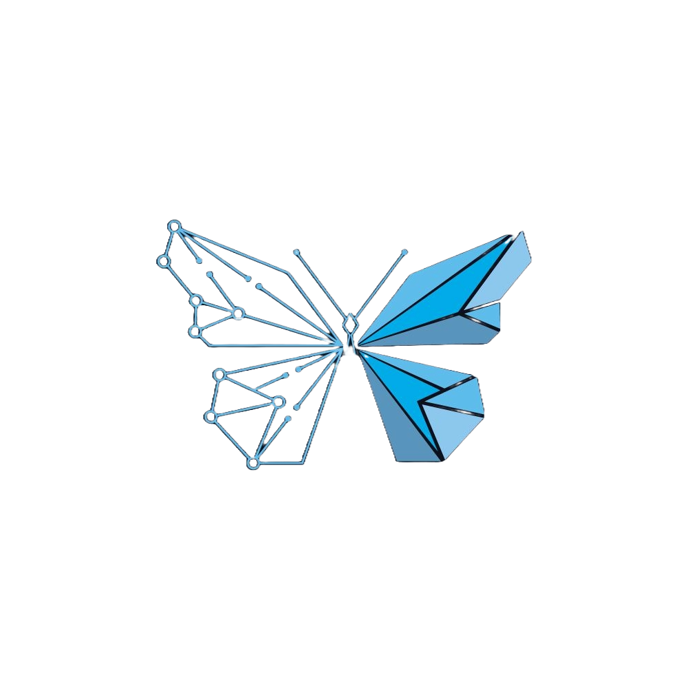

<p align="center">
  
  <h1 align="center">DevDeck - Plataforma de Conexão de Talentos em Desenvolvimento</h1>
</p>

---

## 💻 *O que é o DevDeck?*

O **DevDeck** é uma plataforma web moderna desenvolvida com `JSON` como `mock de API`, `React`, `React Router DOM`, `Vite` e `Tailwind CSS`, criada para conectar empresas inovadoras a profissionais de tecnologia altamente capacitados.
Em um cenário onde a velocidade, a flexibilidade e a especialização são essenciais, o DevDeck nasce para atender às novas demandas do **mercado do futuro** — *um mercado dinâmico, descentralizado e impulsionado por trabalho sob demanda.*

--- 

## 🧠 *Objetivos* 

- Oferecer um ambiente intuitivo, eficiente e de alta performance que permita:

- Talentos da tecnologia apresentarem seus perfis de forma completa, profissional e atrativa — incluindo habilidades, experiências, áreas de atuação e portfólios.

- Empresas, startups e recrutadores encontrarem rapidamente os profissionais ideais para projetos curtos, demandas específicas ou serviços freelance, sem burocracia.

## *Por que o DevDeck?*

O modelo tradicional de contratação não acompanha mais o ritmo das inovações. Processos longos, lentos e rígidos impedem empresas de aproveitarem oportunidades e talentos de mostrarem seu valor.

*Pensando nisso, o DevDeck foi projetado para:*
```
- Acelerar conexões entre quem precisa de soluções e quem sabe criá-las.

- Reduzir barreiras burocráticas comuns em contratações tradicionais.

- Valorizar profissionais independentes e criadores de soluções tecnológicas.

- Criar um espaço colaborativo onde projetos acontecem por habilidade, propósito e agilidade — não por papelada.

- Visão do projeto
```
---

##### *Acreditamos em um futuro onde:*

O trabalho é mais flexível.

A contratação é mais inteligente.

A tecnologia é construída por redes dinâmicas de talentos.

Assim, o DevDeck se posiciona como uma ponte entre empresas visionárias e profissionais que moldam o amanhã, oferecendo um marketplace rápido, responsivo e focado no que realmente importa: talento, solução e resultado.

---

## 🌍 *Visite o site do nosso Projeto!!*

[DevDeck](https://devdeck.vercel.app/)


---

## 🛠️ *Principais Tecnologias Utilizadas*

- ` React JS ` + ` Vite `

- Estilização com ` Tailwind CSS `

- Gerenciamento de Rotas e Navegação entre Páginas, com ` React Router DOM `

- Simulação de perfis utilizando pacote integrado ` JSON `

- Criação de Componentes Reutilizáveis e Gerenciamento de Estado

- Design Atômico, Rápido e Totalmente Responsivo

- Componente para Alternar entre temas Claro e Escuro, com Dark Mode Toggle

---

## ✅ *Funcionalidades Implementadas*

|Navegação Completa:  | Estrutura de rotas para Home, Talentos, Contato e Cadastro.|
|---------------------|--------------------------------------------------------------------|
| Design Responsivo:  |Layout adaptável a qualquer dispositivo (Mobile, Tablet, Desktop).|
|Formulários Funcionais:|Formulários de Contato e Cadastro com gerenciamento de estado via useState.|
|Dark Mode |Suporte completo de Dark Mode utilizando Tailwindcss |


---

## 🚀 *Instalação do Projeto (Passo a Passo)*

Siga os passos abaixo para clonar o projeto e executá-lo em seu ambiente de desenvolvimento local.

### 1. Pré-requisitos

Certifique-se de ter o [` Node.js ` ](https://nodejs.org/en/download) instalado em sua máquina (versão 18+ recomendada).

---

### 2. Clonar o Repositório


*Abra seu terminal ou prompt de comando e execute:*

```

git clone [https://github.com/larissashiba/DevDeck]
cd nome-da-pasta-que-voce-abriu
```
---

### 3. Instalar Dependências

*Instale todas as dependências do projeto listadas no ` package.json `:*

```
npm install
# ou
yarn install
```

---

### 4. Executar o Projeto

*Inicie o servidor de desenvolvimento. O projeto estará disponível em **http://localhost:5173/** (ou outra porta indicada pelo terminal).*

```
npm run dev
# ou
yarn dev
```

---

### 5. Compilar para Produção (Build)

*Para gerar uma versão otimizada e estática do projeto para deploy:*
```
npm run build
# ou
yarn build
```
---

## ✨ *Projeto Realizado Por*

| [<br><sub>Larissa Shiba</sub>](https://github.com/larissashiba) | 
| :---: |